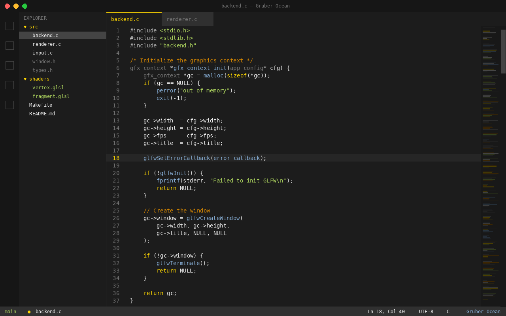

# Gruber Ocean — VS Code Theme

A dark, minimal color theme for VS Code, ported from the [Gruber Ocean vim theme](https://github.com/ruscito/gruber-ocean).

**[Install from VS Code Marketplace](https://marketplace.visualstudio.com/items?itemName=ruscito.gruber-ocean)**

## Philosophy

Minimal highlighting — only what matters gets color:

| Element     | Color                          |
|-------------|--------------------------------|
| Keywords    | **Yellow** `#ffd700`           |
| Strings     | **Green** `#afd75f`            |
| Functions   | **Cyan-Blue** `#87afd7`        |
| Types       | **Gray** `#767676`             |
| Comments    | **Brown/Orange** `#d78700`     |
| Everything else | **White** `#eeeeee`        |

## Installation

### From Marketplace
1. Open VS Code
2. `Ctrl+Shift+X` to open Extensions
3. Search for **Gruber Ocean**
4. Click **Install**

### From VSIX
1. Download the `.vsix` file from [Releases](https://github.com/ruscito/gruber-ocean-vscode/releases)
2. In VS Code: `Ctrl+Shift+P` → **Extensions: Install from VSIX...**
3. Select the file and reload

### Manual
1. Copy this folder to `~/.vscode/extensions/`
2. Restart VS Code
3. `Ctrl+Shift+P` → **Preferences: Color Theme** → **Gruber Ocean**

## Language Support

Includes optimized token colors for: C, Rust, Python, Go, JavaScript/TypeScript, HTML, CSS, Markdown, JSON, YAML, TOML, Lua, and more.

## Contributing

Contributions are welcome! Feel free to open an issue or submit a pull request.

The theme colors live in `themes/gruber-ocean-color-theme.json`. To test changes locally, copy this repo to `~/.vscode/extensions/` and reload VS Code.

## Related

- [Gruber Ocean for Vim](https://github.com/ruscito/gruber-ocean) — the original vim theme

## License

[MIT](LICENSE)

## Credits

Based on the Gruber Darker color scheme with ocean-blue function modifications by [ruscito](https://github.com/ruscito).
